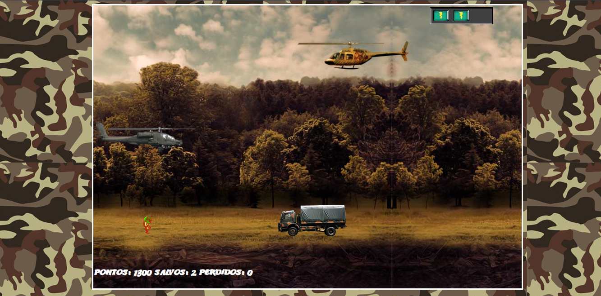
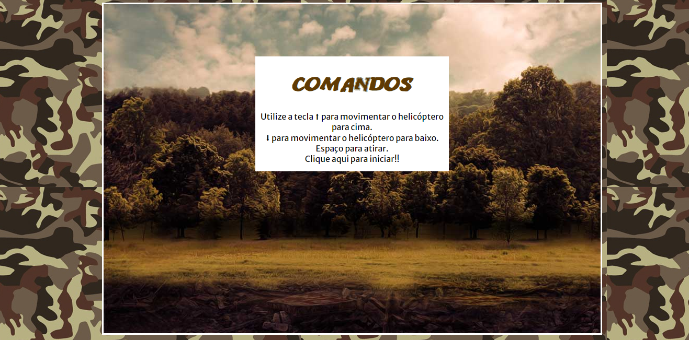

  
# <a href="https://matheussan99.github.io/Jogo_Helicoptero/">➡️➡️➡️Clique Aqui - Jogo Helicoptero ⬅️ ⬅️ ⬅️ <a/>

## Dio BootCamp Órbi Web Games Developer
  

  
### Linguagens Usadas:  
  

  

  

# Principais Funções do Jogo:

  
- Destruir inimigos e salvar o soldado.
- Sistema de pontuação.
- Game over e try again.
- Dificuldade progressiva
- Destruir o helicóptero inimigo te Gera 100 pontos
- Destruir o caminhão te dá 50 pontos
- Salvar o soldado te garante 1 vida extra!!
- Ser atingido te fará perder 1 vida!
- Trilha sonora Saint Seiya :)

## Comandos do Jogo
  
##  ⬆️ Move pra cima
##  Espaço - Atira
##  ⬇️ Move pra baixo

    
  

    
###  Jogo Rodando
  
     
 
###  Menu Principal
  
  
 

### Game Over
  
  
  
  
   
  
 ## 💬 Me Encontre por aí:   

 
 
 
   
  

 
